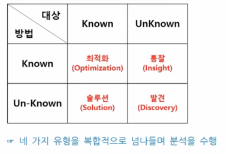
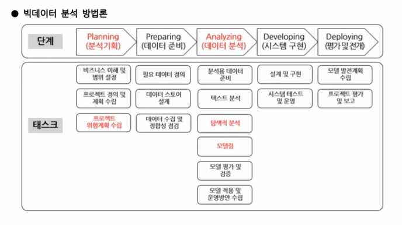
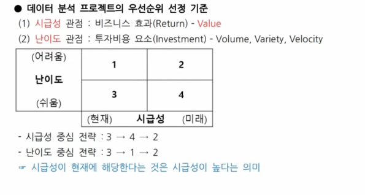
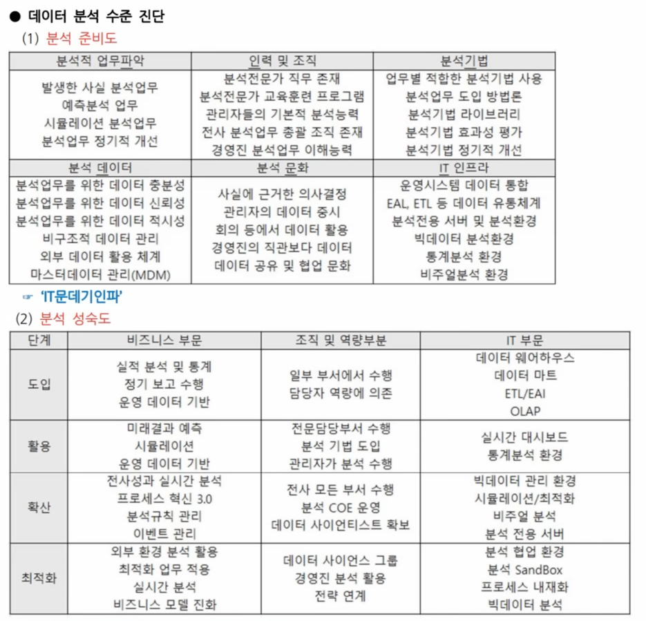
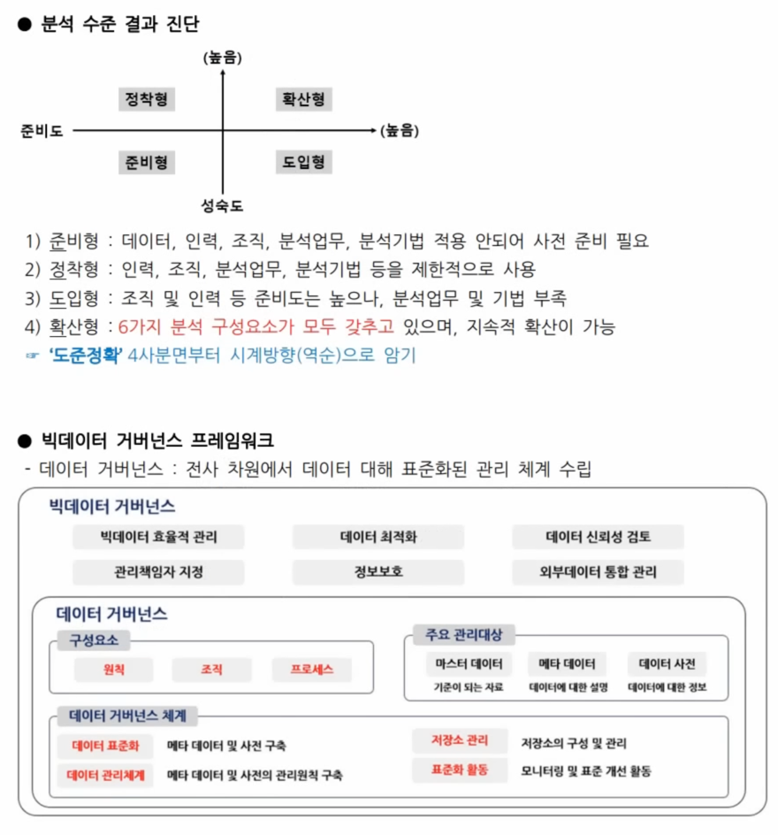

# 데이터분석 기획

## 데이터분석 기획의 이해

- 분석 기획 방향성 도출

### 분석 대상과 방법에 따른 유형

- 분석대상(what), 방법(how)가 알려져 있는지에 따라 분류
- 

### 접근 방식에 따른 유형

|       | 과제 중심적 접근       | 장기적 마스터 플랜         |
|-------|-----------------|--------------------|
| 목적    | 빠르게 해결          | 지속적 분석 원인 해결       |
| 1차 목표 | Speed & Test    | Accuracy & Deploy  |
| 과제 유형 | Quick & Win     | Long Term View     |
| 접근 방식 | Problem Solving | Problem Definition |

### 분석 기회 고려사항

- 가용 데이터 파악 : 분석의 기본이 되는 데이터 확보 및 파악
- 적절한 유스케이스 탐색 : 기존에 잘 구현 되어있는 유사 시나리오 활용
- 장애요소에 대한 사전계획 수립 : 장애 요인 사전 파악 및 대응 전략 마련

## 분석 방법론

### 구성요소

- 절차, 방법, 도구와 기법, 템플릿과 산출물

### 모델 유형

- 계층적 프로세스 모델
- 폭포수 모델
- 프로토 타입 모델
- 나선형 모델
- 에자일 모델

### KDD 분석 방법론

- 데이터 선택 -> 전처리 -> 변환 -> 데이터 마이닝 -> 해석/평가
- 데이터 선택 : 원시데이터나 DB에서 필요한 데이터 선택
- 전처리 : 결측치 처리, 이상치 제거, 중복 데이터 제거 등
- 변환 : 데이터 마이닝에 적합한 형태로 변환
- 데이터 마이닝 : 패턴 발견, 모델 생성
- 해석/평가 : 결과 해석, 모델 평가

### CRISP-DM 방법론

- 비즈니스 이해 -> 데이터 이해 -> 데이터 준비 -> 모델링 -> 평가 -> 배포
- 비즈니스 이해 : 분석 목표 설정, 요구사항 파악
- 데이터 이해 : 데이터 수집, 탐색적 분석
- 데이터 준비 : 데이터 정제, 변환, 통합
- 모델링 : 알고리즘 선택, 모델 학습, 모델 작성 및 평가
- 평가 : 분석결과 평가, 모델링 과정 평가, 모델 적용성 평가
- 배포 : 모델 운영 환경 적용, 모니터링
- 평가 -> 배포에서 위대한 실패(비즈니스 이해로 다시 돌아감) 발생 가능

### 빅데이터 분석 방법론

1. 분석기획

- 비즈니스 이해 및 범위 설정 : SOW(Statement of Work) 작성 -> 구조화된 프로젝트 정의서
- 프로젝트 위험계획 수립 : 회피, 전이, 완화, 수용

2. 데이터 준비

- 데이터 스토어 설계 : 정형, 비정형, 반정형 데이터에 딸느 효율적 저장소를 설계

3. 데이터 분석

- 탐색적 데이터 분석(EDA) : 기초 통계량 및 시각화를 통해 데이터 특성 파악
- 모델링 : 분류, 회귀, 군집 등 알고리즘 적용

## 분석 과제 발굴

### 분석과제 명세

- 분석과제 정의서 : 분석 계획서 수립을 위한 핵심 입력 자료
- 분석 활용 시나리오 : 분석 결과를 어떻게 적용할지 구체적으로 정의한 실행 중심 문서

### 하향식 접근 방법

- 문제가 주어지고 해답을 찾기 위해 진행
- 문제탐색 -> 문제정의 -> 해결방안탐색 -> 타당성 검토

1. 문제 탐색

- 비즈니스 모델 기반 탐색 : 지원인프라, 업무, 고객, 제품, 규제와 감사

- 발굴 범위 확장
    - 거시적 관점 STEEP(Social, Technological, Economic, Environmental, Political) 분석
    - 경쟁자 확대 관점 : 대체자, 경쟁자, 신규 진입자
    - 시장의 니즈 탐색 관점 : 고객, 채널, 영향자
    - 역량의 재해석 : 내부 역량, 파트너 네트워크

- 내/외부 사례 참조
    - 외부 참조 모델 기반(벤치마킹), 분석 유스케이스(과거 유사한 사례)

2. 문제 정의 : 비즈니스 문제를 데이터 문제로 변환하여 정의
3. 해결방안 탐색 : 기존 시스템 활용, 시스템 고도화, 인적 자원 확보, 아웃소싱 등
4. 타당성 검토 : 경제적 타당성, 데이터 타당성, 기술적 타당성

### 상향식 접근 방법

- 문제 정의 자체가 어려울 때, 사물을 그대로 인식
- 프로세스 분류 -> 프로세스 흐름 분석 -> 분석요건 식별 -> 분석요건 정의
- 상향식 접근법의 적용 방법 : 비지도학습, 프로토타이핑 접근법

### 혼합 접근 방법

- 발산 단계 : 상향식 접근 방법, 가능한 방안들을 도출
- 수렴 단계 : 하향식 접근 방법, 도출된 방안들을 분석
- 디자인 씽킹 : 
공감 -> 문제 정의 -> 아이디어 도출 -> 프로토타입 -> 테스트

## 분석 프로젝트 관리 방안
### 분석 프로젝트 관리 요소
- 데이터의 양, 속도, 데이터 복잡성, 분석 복장섭, 정확도/정밀도
- 정확도랑 정밀도는 Trade-off 관계 (상충관계) / 3과목 오분류표에서 평가지표와 다른 개념

### 프로젝트 관리 지식 체계 
- 통합, 범위, 시간(일정), 원가, 품질, 인적자원, 의사소통, 위험, 조달(아웃소싱), 이해관계자 관리

## 분석 마스터 플랜 - 마스터 플랜 수립

### IT 프로젝트의 우선순위 선정 기준
- 중장기 마스터 플랜을 수립 위하여 ISP를 활용
- 비지니스 성과
- 전략적 중요도 : 전략적 필요성(조직의 비전, KPI), 시급성 (해결 지연 시 Risk 증가)
- 실행 용이성 : 투자 용이성(예산 확보, ROI), 기술 용이성(기술 구현 난이도)

### 데이터 분석 프로젝트의 우선순위 선정 기준

### 데이터 분석 로드맵
- 데이터 기반 의사결정을 조직에 정착시키기 위한 중장기 계획
-  체계 도입 단계 -> 유효성 검증 단계 (파일럿 프로젝트 수행) -> 확산 및 고도화 단계

## 분석 거버넌스 체계 수립
- 분석 거버넌스 체계 구성요소
- 조직, 프로세스, 시스템, 데이터, 분석관련 교육 및 마인드 육성 체계

- IT문데기인파 

- 분석 성숙도 진단은 CMMI 모형(5단계)을 기반

### 분석 지원 인프라 방안 수립
- 확정성을 고려한 플랫폼 구조 적용(중장집중적 관리)
- 광의의 분석 플랫폼 : 분석 서비스 제공엔진, 분석 어플리케이션, 분석 서비스 API, 하드웨어 
- 협의의 분석 플랫폼 : 데이터 처리 프레임워크, 분석엔진, 분석 라이브러리
- 광의의 분석 플랫폼은 협의의 분석 플랫폼 요소를 포함하는 개념

### 분석 조직 운영 방안 수립 (DSCoE: 분석조직)
- 집중 구조 : 독립적인 전담 조직 구성 (중복 업무 가능성 존재)
- 기능 구조 : 해당 부서에서 직접 분석 (DSCoE 없음)
- 분산 구조 : 분석 조직 인력을 현업 부서에 배치

### 출처

- https://www.youtube.com/watch?v=rClfO1GdmFM&list=PLWtr7MRpQi5CW-jFYgAsX4jZcSp77O3a5&index=2