# 데이터 분석

## R기초와 데이터 마트

### DM (Data Mart)

- 소규모 데이터 웨어하우스
- 특정 주제나 부서에 맞춘 데이터 저장소

### 요약변수와 파생변수

- 요약변수: 데이터의 핵심 정보를 종합, 요약한 변수 (예: 평균, 합계), 재활용성 높음
- 파생변수 : 의미를 부여한 변수, 논리적 타당성 필요

## 결측값 처리와 이상값 검색

### EDA(탐색적 자료 분석)

- 통계, 시각화
- 저항성 강조
- 잔차 계산
- 자료변수의 재표현
- 그래프를 통한 현시성

### 결측값 처리

- 존재하지 않는 데이터, null/na 로 표시
- 완전분석법 : 결측값 가지는 데이터 삭제
- 평균대치법
    - 비조건부 평균대치법 : 단순 평균으로 대치
    - 조건부 평균 대치법 : 회귀분석의 결과로 대치
- 단순 확률 대치법
    - Hot-Deck 대치법 : 유사한 관측치의 값으로 대치
    - Cold-Deck 대치법 : 과거의 관측치 값으로 대치
    - Nearest Neighbor 대치법 : 유사한 관측치의 값으로 대치
- 다중 대치법 : 여러 개의 대치값 생성, 불확실성 반영
- 대치하는 이유 : 표본 수가 지나치게 줄어드는 것을 방지하기 위해

### 이상값 검색

- 이상값을 항상 제거하는 것 아님
- ESD
    - 평균으로부터 표준편차 3배가 넘어가는 데이터 이상값 판단
    - 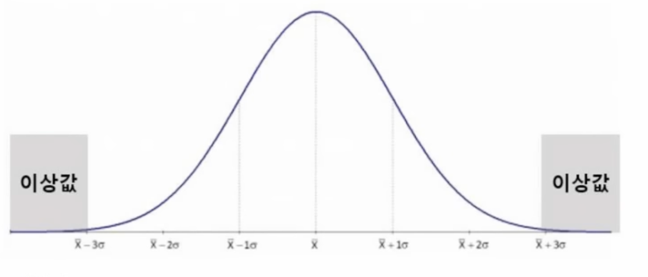
- 사분위수 (Box Plot)
    - Q1 - 1.5 * IQR 보다 작거나 Q3 + 1.5 * IQR 보다 큰 값 이상값 판단
    - 상한, 하한 최솟값, 1~3사분위값, 최대값 등을
    - 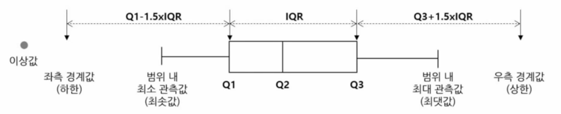
      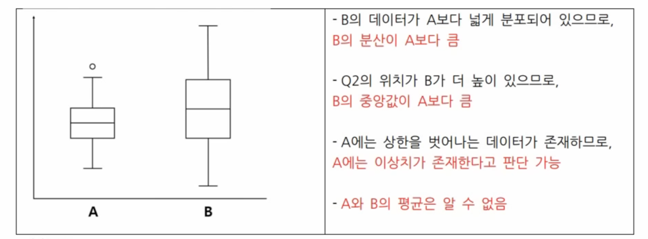

## 통계 분석

### 자료의 척도 구분

- 질적 척도
    - 명목 척도 : 어느 집단에 속하는지 나타내는 자료 (대학교, 성별)
    - 순서 척도(서열 척도) : 서열관계가 존재하는 자료(학년, 순위)
- 양적 척도
    - 등간 척도(구간 척도) : 구간 사이 간격이 의미가 있으며 덧셈과 뺄셈만 가능 (온도, 지수 등)
    - 비율 척도 : 절대적 기준 0이 존재하고 사칙연산 가능, 가장 많이 수집되는 자료 (무게, 나이 등)

### 기초 확률

1. 사건 : 어떤 실험에서 일어날 수 있는 결과의 집합
2. 표본 공간 : 모든 가능한 결과의 집합
3. 확률 : 사건이 일어날 가능성의 정도 (0~1 사이)
4. 확률의 덧셈 정리 : 두 사건 A, B가 서로 배반일 때

- P(A or B) = P(A) + P(B) - P(A and B)

5. 조건부 확률 : 사건 B가 일어났을 때 사건 A가 일어날 확률

- P(A|B) = P(A and B) / P(B)

6. 독립사건 : 사건 A와 B가 서로 독립일 때

- P(A and B) = P(A) * P(B)

7. 배반사건 : 두 사건이 동시에 일어날 수 없는 사건

- P(A and B) = 0

### 기초 통계 이해

1. 확률 변수 : 확률 실험의 결과에 수치를 대응시키는 변수
2. 기대값 : 확률 변수의 평균값
    - 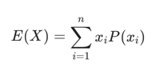
3. 분산 : 확률 변수의 흩어짐 정도
4.
    - 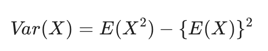
4. 이항분포 : 성공 확률이 p인 베르누이 시행을 n번 반복했을 때 성공 횟수의 분포
5. 정규 분포 : 평균과 표준편차로 정의되는 연속 확률 분포
6. 표준정규분포 : 평균이 0이고 표준편차가 1인 정규분포
7. 이산확률분포 : 확률 변수가 이산적인 값을 가지는 분포
   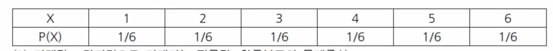

## 기초 통계분석

### 기초 통계량

#### 중심 경향 측면

- 평균, 중앙값, 최빈값

#### 분산 정도 측면

- 범위 : 최대값에서 최솟값을 뺀 값, 이상치에 민감
- 분산과 표준편차로 이상치에서 자유로워짐
- 사분위수와 IQR : 데이터를 4등분하여 **중간 50% 데이터가 퍼진 범위(Q3−Q1)**를 측정함. 극단적인 값에 영향을 받지 않고 데이터의 중심적인 분포를 파악할 때 유용함
- 변동계수(CV) : 표준편차를 평균으로 나눈 값, 단위가 다른 자료 비교에 유용

#### 관계 측면

- 공분산 : 두 변수 간의 관계 방향과 정도 측정
    - = 0 : 독립, > 0 : 양의 상관관계,  < 0 : 음의 상관관계, 최소, 최대값 없어 강약 판단 불가
- 상관계수 : 공분산을 표준화한 값, -1에서 1 값으로 표현
    - = 1 : 완전한 양의 상관관계, -1 : 완전한 음의 상관관계, 0 : 독립
- 공분산과 독립성의 관계
    - 두 변수가 독립이면 공분산은 0이지만, 공분산이 0이라고 두 변수가 독립이라고 할 수 없음 (선형 관계만 없을 뿐, 비선형 관게 존재할 수 있음)
- 표준 공분산 : 공분산을 각 변수의 표준편차로 나눈 값 (n-1로 나눔)
- 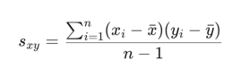

### 첨도와 왜도

- 첨도 : 분포의 뾰족한 정도 측정
- 첨도 = 3: 정규 분포 형태
- 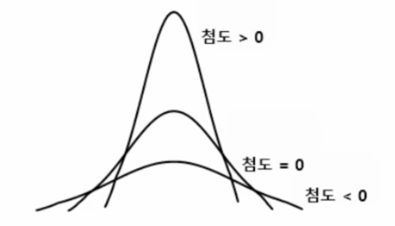
- 왜도 : 분포의 비대칭 정도 측정
    - 왜도 < 0 : 최빈값 > 중앙값 > 평균값 (오른쪽 꼬리)
    - 왜도 > 0 : 최빈값 < 중앙값 < 평균값 (왼쪽 꼬리)
      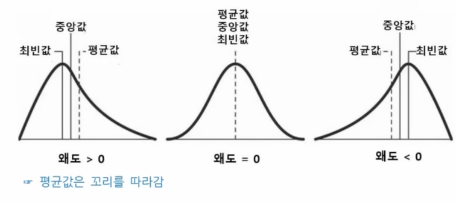

### Summary 함수 결과 해석

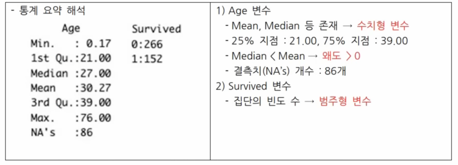

### 추론 통계

- 일부 표본의 데이터를 바탕으로 모집단 추정하거나 가설을 검정하는 통계 기법
- 모집단 -> 표본추출 -> 표본집단 -> 모집단 예측(추정, 가설검정)

### 표본추출 방법

1. 랜덤 추출법 : 무작위로 표본 추출
2. 계통 추출법 : 번호 부여하여 일정 간격으로 추출
3. 집락 추출법(=군집 추출법)

- 모집단을 여러 개의 집락으로 나누고, 일부 집락을 무작위로 선택하여 표본 추출
- 집락 내 이질성이 크고, 집락 간 동질성이 클 때 효과적

4. 층화 추출법

- 모집단을 동질적인 층으로 나누고 각 층에서 무작위로 추출
- 같은 비율로 추출 시, 비례 층화 추출법

5. 복원, 비복원 추출

- 복원 추출 : 추출되었던 데이터를 다시 포함시켜 표본 추출
- 비복원 추출 : 추출된 데이터를 제외하고 표본 추출

### 확률 분포 (누포항하)

- 확률 변수의 개별 값들이 가지는 확률 값의 분포
- 이산 확률 분포 : 확률 변수가 이산적인 값을 가지는 분포
- 베르누이 분포 : 결과가 두가지 중 한가지로 나타나는 베르누이시행으로 나타나는 분포
- 이항 분포 : 성공 확률이 p인 베르누이 시행을 n번 반복했을 때 성공 횟수의 분포
- 초기하 분포 : 비복원 추출에서 성공 횟수의 분포
- 포아송 분포 : 단위 시간 또는 단위 공간 내에서 사건이 발생하는 횟수의 분포
- 기하 분포 : 최초 성공까지의 실패 횟수의 분포
- 음이항 분포 : 기하 분포를 일반화, k번째 성공까지의 실패 횟수의 분포

베르누이 분포를 n번 하면 -> 이항 분포 -> 비복원이면 초기화분포 OR n번 반복하면 포아송 분포
기하분포를 일반화하면 음이항분포

### 연속 확률분포

1. 균일 분포 : 구간 내에서 모든 값이 동일한 확률로 나타나는 분포
2. 정규 분포 : 평균과 표준편차로 정의되는 연속 확률 분포
3. t 분포 : 모분산이 알려지지 않은 경우에 사용되는 정규 분포의 근사 분포
4. 카이제곱 분포 : 정규 분포를 따르는 k개의 독립적인 확률 변수의 제곱합으로 정의되는 분포
5. F 분포 : 두 개의 카이제곱 분포의 비율로 정의되는 분포

### 확률분포의 기댓값

1. 이산적 확률 변수
2. 연속적 확률 변수
   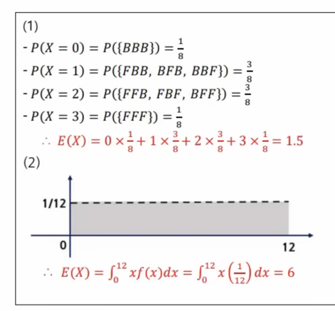

### 중심극한정리

- 표본의 크기가 충분히 크면, 표본평균의 분포는 모집단의 분포와 상관없이 정규분포에 근접
- 표본의 크기가 클수록 표본평균의 분포는 정규분포에 가까워짐

### 표본평균의 표본분포

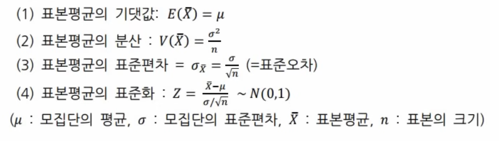

### 점추정

- 모집단이 특정한 값으로 추정, 추정량으로 모수를 추정
- 조건 : 불효일충
- 불편성 : 추정량의 기댓값이 실제 모수와 같음
- 효율성 : 추정량의 분산이 다른 추정량보다 작음
- 일치성 : 추정량이 표본 크기가 커질수록 실제 모수에 가까워짐
- 충족성 : 표본에서 추정량이 가지는 정보가 모수에 대한 모든 정보를 포함
  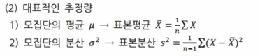

### 구간추정

- 모집단이 특정한 구간으로 추정

- 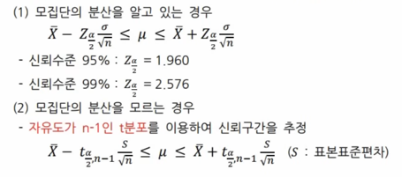

### 가설검정

- 모집단의 특성에 대한 주장을 가설로 세우고 표본조사로 가설의 채택여부를 판정
- 귀무가설(H0) & 대립가설(H1) : 현재 상태인 귀무가설(H0)과 새롭게 증명하려는 대립가설(H1) 설정
- 유의수준(α) : 귀무가설이 참인데 실수로 기각할 확률의 최대 허용치 (보통 0.05로 설정)
- 유의확률(p-value) : 귀무가설이 참일 때 현재와 같은 표본 결과가 나올 확률 (p≤α 이면 귀무가설 기각)
- 제1종 오류: 실제로는 참인 귀무가설을 잘못 기각하는 오류이며, 유의수준은 이를 통제하기 위한 지표임
- 제2종 오류: 실제로는 거짓인 귀무가설을 잘못 채택하는 오류
- 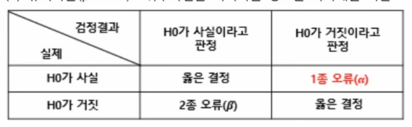

### 가설 검정 R결과 해석

1. 귀무가설 / 대립가설 설정
   차이가 없다 혹은 동일하다 (귀무가설)
2. 양측 혹은 단측검정 확인

- 대립가설 값이 같지 않다 -> 양측검정 / 값이 크다, 작다 -> 단측검정

3. 일표본 혹은 이표본 확인

- 하나의 모집단 -> 일표본 / 두개의 모집단 -> 이표본

4. 귀무가설 기각 혹은 채택

- p-value < α -> 귀무가설 기각
- p-value > α -> 귀무가설 채택

5. t 검정인 경우 - 단일표본, 대응표본, 독립표본 확인

- 모집단에 대한 평균검정 -> 단일표본
- 동일 모집단에 대한 평균비교 검정 -> 대응표본
- 서로 다른 두 집단의 평균 비교 -> 독립표본

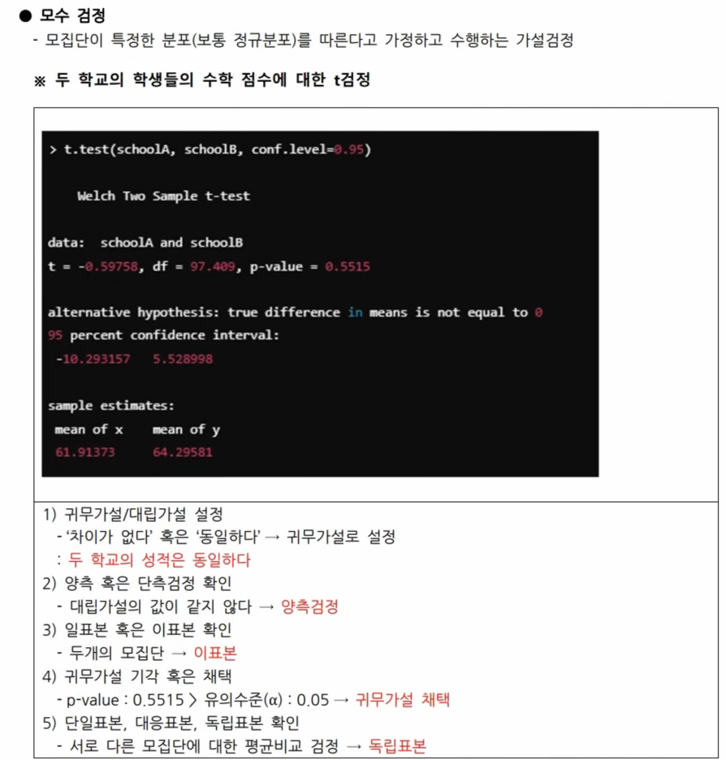

- 독립표본 t-검정은 두 집단의 분산이 같다는 가정(등분산 가정)이 전제가 되며, 등분산을 가정하지 않는 경우 Welch의 t-검정을 사용

### 비모수 검정

- 모집단에 대한 아무런 정보가 없어, 관측 자료가 특정 분포를 따른다고 가정 불가 시 검정
- 두 관측 값의 순위나 차이로 검정, 순위 기반 검정
- 부호검정, 순위합검정 , 맨-휘트니 U 검정, 크루스칼-왈리스 검정, 콜모고르프-스미르노프 검정, 카이제곱 검정 등이 있음

### 회귀분석

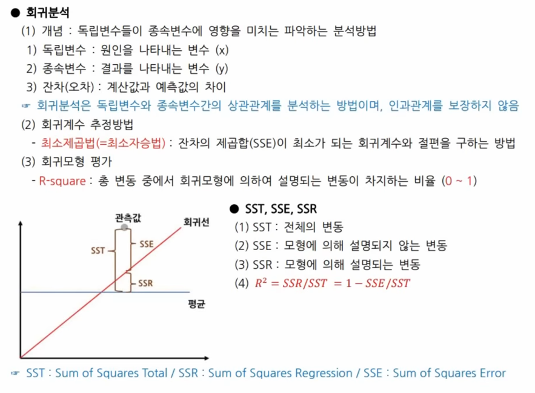

### 회귀분석 종류

1. 단순회귀 : 하나의 독립변수로 종속변수 예측
2. 다중회귀 : 여러 독립변수로 종속변수 예측
3. 다항회귀 : 독립변수와 종속변수 간의 비선형 관계 모델링
4. 규제항이 포함된 회귀
    - 릿지 회귀 : L2 규제항 사용, 과적합 방지 (제곱)
    - 라쏘 회귀 : L1 규제항 사용, 변수 선택 가능 (절대값)
    - 엘라스틱넷 : L1과 L2 규제항 결합
5. 교호항이 포함된회귀 : 독립변수 간의 상호작용 효과 모델링

### 선형회귀분석의 가정

1. 선형성 : 독립변수와 종속변수 간의 선형 관계
2. 등분산성 : 오차의 분산이 고르게 분포
3. 정규성 : 오차항이 정규분포를 따름
4. 독립성 : 오차항들이 서로 독립

### 다중공선성 문제

- 독립변수들 간 강한 상관관계가 나타나는 문제

1. 진단 방법
    - 변수간 상관계수 절댓값이 0.8 이상이면 의심
    - VIF(분산팽창요인) 값이 10 이상이면 다중공선성 존재한다고 판단
    - 조건수가 30이상이면 의심
2. 해결 방법 : 독립 변수 제거, 차원 축소, 변수 선택, 규제항이 포함된 회귀

### 최적의 회귀 방정식 탐색 방법

1. 전진선택법 : 유의한 변수를 하나씩 추가
2. 후진제거법 : 유의하지 않은 변수를 하나씩 제거
3. 단계적 선택법 : 전진선택법과 후진제거법을 결합

- AIC : 정보 기준, 값이 작을수록 좋은 모델
- BIC : 베이지안 정보 기준, 값이 작을수록 좋은 모델
- Mallows Cp : SSE(잔차 제곱합)을 활용한 판단

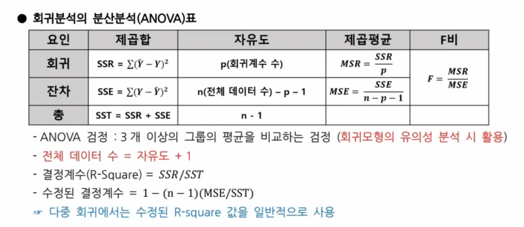

### 회귀 모형의 검정

1. 독립변수와 종속변수 설정
2. 회귀계수 값의 추정
3. 모형이 통계적으로 유의미한가 : 모형에 대한 F 통계량, p-value 확인
4. 회귀계수들이 유의미한가 : 회귀계수들의 t 통계량, p-value 확인

- 각각의 회귀계수에 대한 귀무가설 : 해당 회귀계수가 0이다'

5. 1,2 모두를 기각하면 해당 모델 활용
6. 모형의 설명력 확인 : 결정계수 R², 수정된 결정계수 확인

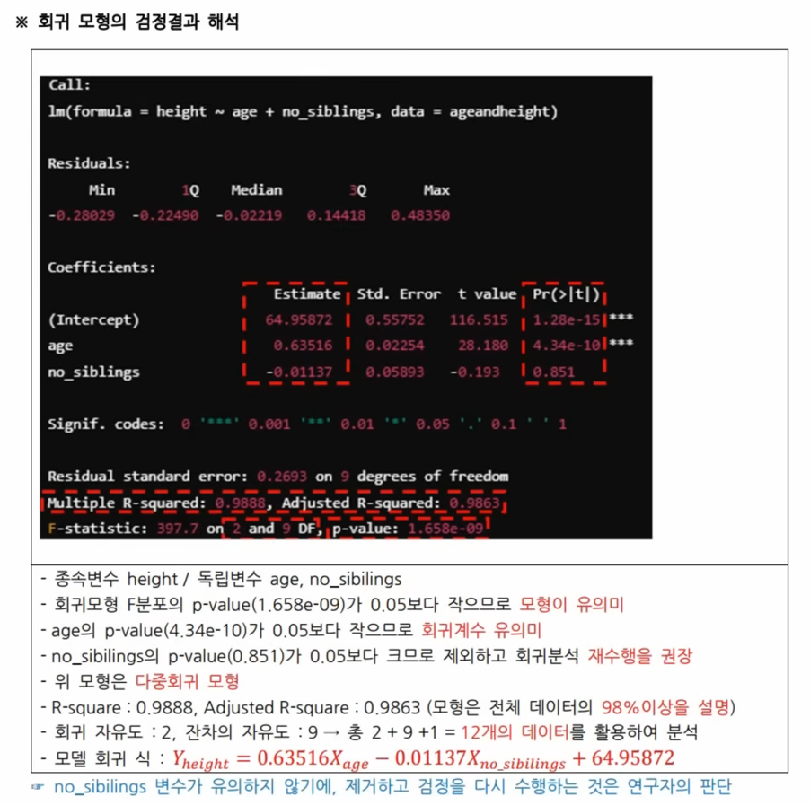

### 다변량 분석

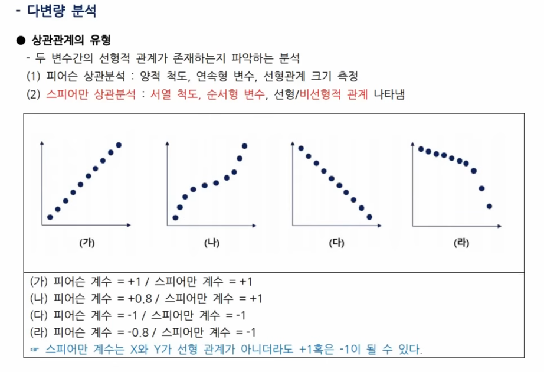

### 주성분 분석(PCA)

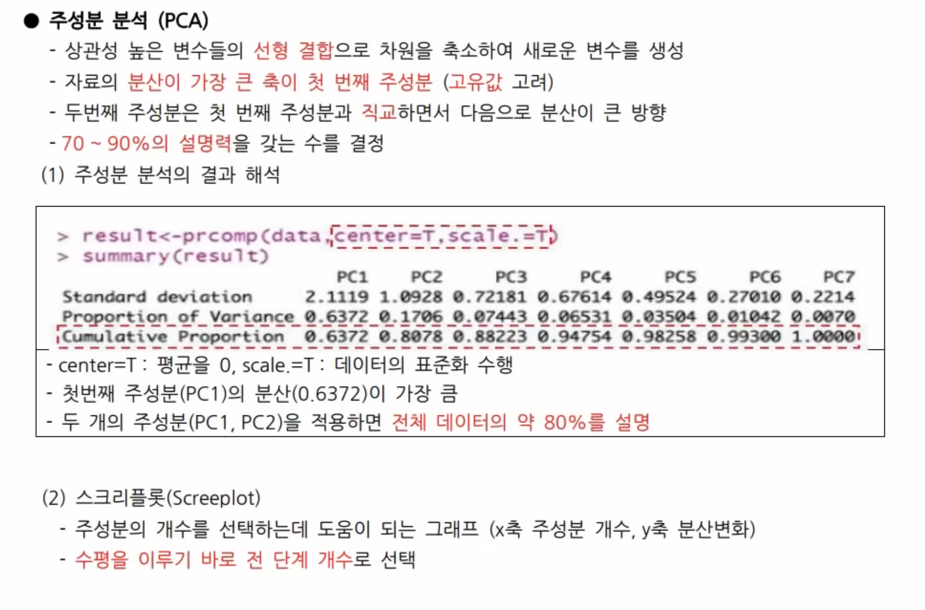
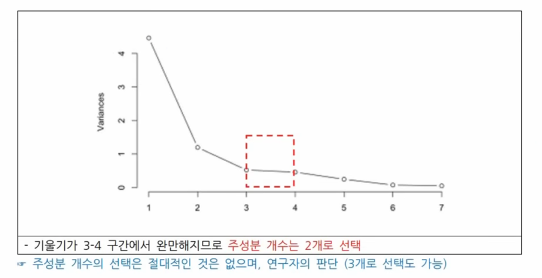

### 다차원 척도법 (MDS)

- 데이터 간 거리 정보의 근접성을 보존하는 방식으로 차원 축소하여 시각화

1. 특징 : 데이터 축소 목적, Stress 값이 0에 가까울 수록 좋음, 글로벌 최적점 도달 어려움
2. 종류 : 계량적 MDS(양적척도 활용), 비계량적 MDS(순서척도 활용)

## 시계열 예측

### 시계열 분석

- 시간에 따라 변화하는 데이터 분석

### 시계열 데이터의 변동 요인

1. 추세 : 장기적인 증가 또는 감소 경향
2. 계절성 : 일정한 주기로 반복되는 패턴
3. 순환성 : 장기적인 주기 변화
4. 불규칙성 : 예측 불가능한 요인에 의한 변동

### 정상성

- 시계열 예측을 위해서는 모든 시점에 일정한 평균과 분산을 가지는 정상성을 만족해야 함

1. 정상시계열로 변환 방법
    - 차분 : 현재 값에서 이전 값을 빼서 정상성 확보
    - 변환 : 로그 변환, 제곱근 변환, Box-Cox 변환 등으로 분산 안정화

### 평활화

- 이동평균법 : 일정 기간의 평균
- 지수평활법 : 최근 데이터에 더 큰 가중치 부여

### 백색 잡음

- 시계열 모형의 오차항을 의미 (평균 및 분산 일정, 자기상관 없음, 정상성 만족)
- 평균이 0 이면 가우시안 백색잡음

### 시계열 모형

1. AR(자기회귀) 모형 : 과거 값들의 선형 결합으로 현재 값 예측
2. MA(이동평균) 모형 : 과거 오차항들의 선
3. ARIMA 모형 : AR과 MA 결합
    - ARIMA(p,d,q)
    - p : AR 차수, d : 차분 횟수, q : MA 차수
    - 계절성이 있는 경우 SARIMA 모형 사용

## 정형 데이터 마이닝 - 데이터 마이닝 개요

### 데이터 마이닝

- 방대한 데이터 속에서 새로운 규칙, 패턴을 찾고 예측을 수행하는 분야
- 목표 정의 -> 데이터 수집 및 이해 -> 데이터 전처리 -> 데이터 마이닝 기법 적용 -> 평가 및 해석

### 데이터 마이닝의 유형

1. 지도학습 : 정답이 있는 데이터를 활용
    - 분류, 회귀
2. 비지도학습 : 정답이 없는 데이터를 활용
    - 군집분석, 연관규칙분석, 차원축소

### 과대적합과 과소적합

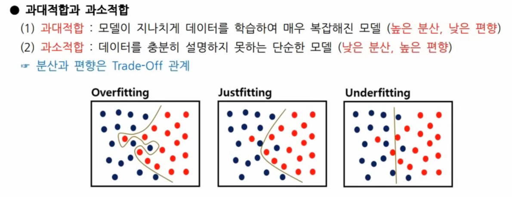

### 데이터 분할과 교차검증

- 과대적합과 과소적합을 방지, 데이터가 불균형한 문제를 해결하기 위해 사용
- 훈련 데이터, 검증 데이터, 테스트 데이터로 분할
    - 홀드아웃 : 전체 데이터를 학습용과 검증용으로 한 번만 나누어 사용
    - k-fold 교차검증 : 데이터를 k개의 폴드로 나누어 k번 학습 및 검증 반복
    - LOOCV : 데이터 포인트 하나를 검증용으로 사용하고 나머지를 학습용으로 사용, 모든 데이터 포인트에 대해 반복
    - 부트스트래핑 : 복원 추출을 활용하여 데이터 셋을 생성, 데이터 부족, 불균형 문제 해소

## 분류 분석

- 과거에 수집된 데이터들의 정답(Label)을 학습하여, 새로운 데이터가 들어왔을 때 어떤 그룹(범주)에 속할지 예측

### 로지스틱 회귀분석

- 종속변수가 범주형 데이터를 대상으로 성공과 실패 2개의 집단을 분류하는 문제에 활용

1. 로지스틱 회귀분석의 원리

- 오즈(Odds) : 사건이 발생할 확률과 발생하지 않을 확률의 비
    - Odds = P(event) / (1 - P(event))  = 성공확률 / 실패확률
- 로짓(Logit) : 오즈의 자연로그 변환, 선형회귀모형 적용 가능
    - Logit(P) = ln(Odds) = ln(P / (1 - P)) = wx + B  (w > 0)
- 시그모이드 함수
    - 로짓 값을 확률 값(0~1)으로 변환
    - P = 1 / (1 + e^(- (wx + B)))

2. 로지스틱 회귀분석의 검정

- 회귀계수 추정 : 최대 우도법
- 모형전체 검정 : 우도비검정 (카이제곱검정)

KNN(K-Nearest Neighbors)

- 거리 기반으로 이웃에 더 많은 데이터가 포함되어 있는 범주로 분류
- 단순하고 효율적이며, 훈련이 따로 필요 없는 Lazy Model
- K에 따라 결과가 달라짐

### 나이브베이즈 분류

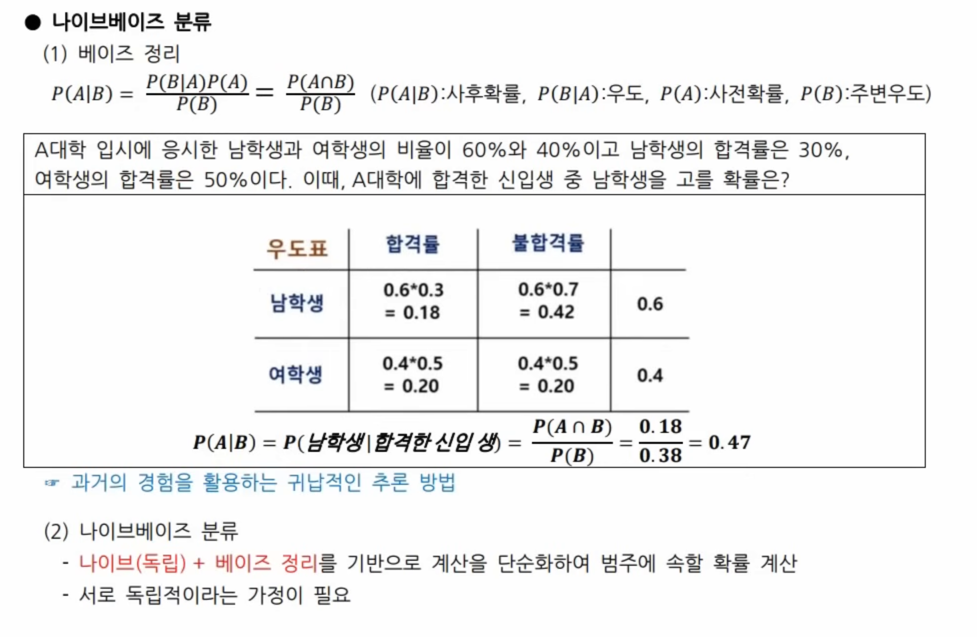

### 의사결정나무

- 노드 내 동질성이 커지고, 노드 간 이질성이 커지는 방향으로 분리하는 트리 구조 모델

1. 특징

- 화이트 박스 모델, 높은 과적합 위험
- 과적합 방지 방안
    - 정지규칙: 분리를 더 이상 수행하지 않고 나무의 성장을 멈춤
    - 가지치기: 일부 가지를 제거하여 과적합을 방지
- 노드 분할 방법
    - 분류(범주형)에서의 분할 방법
        - CHAID 알고리즘 : 카이제곱 통계량
        - CART 알고리즘 : 지니지수 활용 (1 - Σ(p_i)²)
        - C4.5/C5.0 알고리즘 : 정보이득(엔트로피) 활용 (- Σ p_i * log2(p_i))
        - 가치지기 기준 : 지니지수, 엔트로피, 카이제곱통계량
    - 회귀(연속형)에서의 분할 방법
        - CHAID 알고리즘 : ANOVA, F-통계량 활용
        - CART 알고리즘 : 분산감소량
        - 가치지기 기준 : 분산감소량, 잔차제곱합(RSS), MSE 감소

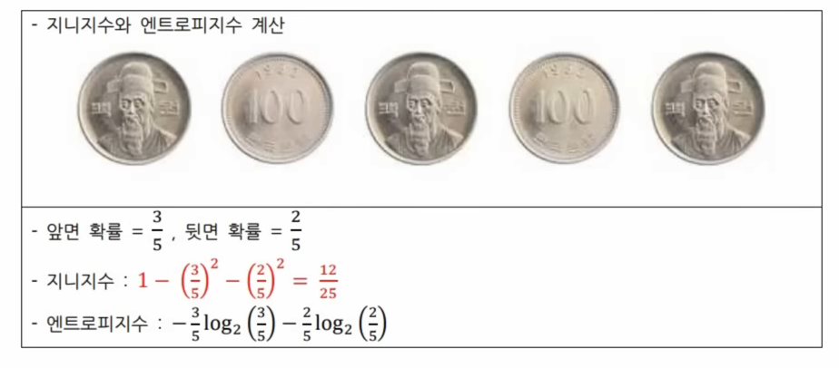

### 서포트벡터머신(SVM)

- 마진이 최대가 되는 초평면을 찾아 선형이나 비선형 이진 분류, 회귀에서 활용 가능한 다목적 모델

1. 구성요소
    - 초평면 : 데이터 포인트를 분리하는 결정 경계, 가중치벡터와 편향으로 결정
    - 서포트 벡터 : 결정 경계에 가장 가까운 데이터 포인트
    - 마진 : 초평면과 서포트 벡터 간의 거리
    - 커널함수 : 저차원 데이터를 고차원 데이터로 변경하는 함수
2. 유형
    - 하드마진분류 : 오류 비허용
    - 소프트마진분류 : 일부 오류 허용

### 앙상볼

- 여러 개의 예측 모형들을 조합하는 기법

1. 보팅 : 다수결 방식으로 최종 모델 선택
2. 배깅 : 여러 개의 훈련 데이터 샘플을 생성하여 각각의 모델 학습 후 평균화
    - OOB : 복원추출을 무한히 반복할 때 특정 하나의 데이터가 선택되지 않을 확률
    - 랜덤포레스트 : 배깅에 의사결정나무를 추가하는 기법, 편향은 높지만 분산이 감소(과적합에 강함), 블랙박스 모델
3. 부스팅 : 잘못된 분류 데이터에 큰 가중치를 주는 방법, 이상치에 민감
    - AdaBoost, GBM, XGBoost, LightGBM
4. 스태킹 : 서로 다른 모델들의 예측 결과를 새로운 데이터로 사용하여 최종 모델 학습

- 보팅, 배깅, 랜덤포레스트는 병렬처리 가능, 부스팅은 병렬처리 불가능

### 인공 신경망

1. 퍼셉트론의 등장과 한계

- 인간의 뉴런과 모방한 단층 퍼셉트론의 등장, XOR 문제 해결 불가
  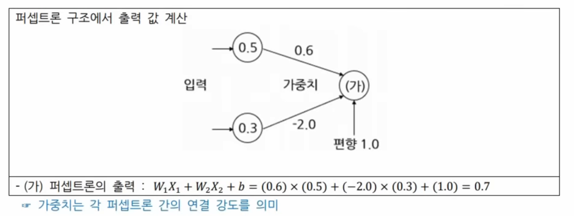
- 입력 값에 가중치를 곱하고 더하는 구조
- 별도 활성화 함수를 쓰지 않거나 선형 함수를 쓰면 수학적으로 선형 회귀식과 같아짐

2. 다층 퍼셉트론 등장

- 입력층과 출력층 사이에 하나 이상의 은닉층을 삽입한 구조
    - 할성함수의 사용 : 시그모이드 함수를 통한 비선형 문제 해결
    - 인공신경망의 특징
        - 블랙박스 모델
        - 은닉층 수와 노드 수는 사용자가 직접 설정하는 하이퍼파라미터
        - 은닉층 수가 많아지면 복잡한 문제 해결 가능하지만, 과적합 위험 증가
        - 은닉층 수가 적어지면 복잡한 패턴 학습 못해 과소적합 가능
- 가중치 계산 : (입력 × 은닉1) + (은닉1 × 출력)
    - 은닉의 개수에 따라 가중치 계산이 달라짐
    - (입력 × 은닉1) + (은닉1 × 은닉2) + (은닉2 × 출력

3. 인공신경망 학습 방법

- 순전파(피드포워드) : 정보가 전방으로 전달
- 역전파 알고리즘: 가중치를 수정하여 손실함수의 값을 줄임 (합성함수의 곱 활용)
- 경사하강법
    - 경사의 내리막길로 이동하여 오차가 최소가 되는 최적의 해를 찾는 기법 (편미분 활용)
- 기울기 소실 문제
    - 다수의 은닉층에서 시그모이드 함수 사용 시, 학습이 제대로 되지 않는 문제

4. 활성함수와 손실함수

- 은닉층에서의 활성함수 : 인공신경망의 선형성을 극복
    - 시그모이드 함수 : 0~1 사이의 확률 값을 가지며, 로지스틱 회귀 분석과 유사
    - 하이퍼볼릭 탄젠트 함수 : -1~1 사이의 값을 가지며, 시그모이드 함수의 기울기 소실문제를 지연
    - ReLU 함수 : 음수 영역에서 기울기가 0이 되어 기울기 소실 문제 해결, max(0,x)
- 출력층에서의 활성함수
    - 시그모이드 함수 : 이진분류 모델, 0~1 사이의 확률 값 출력 (1/(1 + e^(-z)))
    - 소프트맥스 함수 : 다중 클래스 분류 모델, 확률의 총합이 1 ( e^(z_i) / Σ e^(z_j) )
- 손실함수 : 예측값과 실제값의 차이를 측정하는 함수
    - MSE(평균제곱오차) : 회귀문제에서 사용
    - 크로스엔트로피 손실함수 : 분류문제에서 사용
    - 경사하강, 최소한의 오차를 찾기 위함

### 분류모델 평가지표

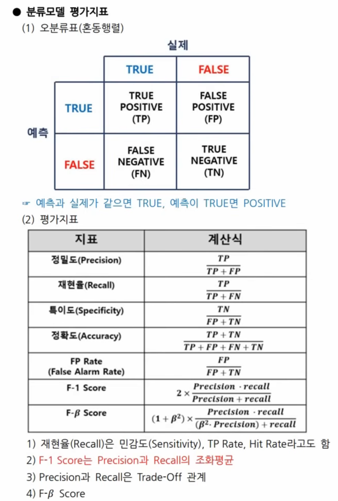

- F-B Score
    - B > 1 : 재현율에 큰 비중
    - B > 0 : 정밀도에 큰 비중
    - B = 1 : F-1 Score와 동일

3. ROC 커브
    - 가로축을 1-특이도(FPR), 세로축을 민감도(TPR)로 하는 그래프
    - 그래프 면적(AUC)은 0.5 ~1 사이이며, 1에 가까울수록 좋은 모델

## 군집 분석

- 비지도 학습을 데이터들 간 거리나 유사성을 기준으로 군집을 나누는 분석
- 계층적 군집 분석 : 덴드로그램을 활용하여 군집 간의 유사성을 시각화
  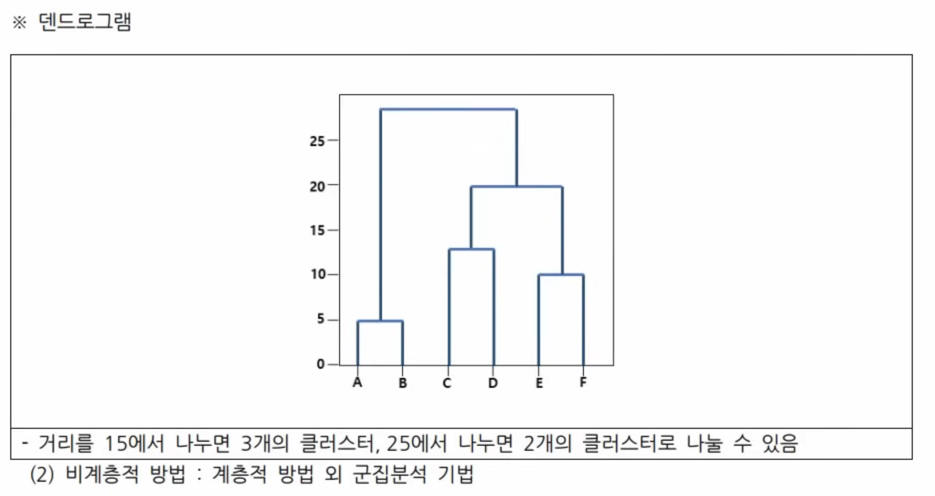

### 거리 측정 방식

- 연속형 변수
    - 유클리디안 거리 : 두 점 사이의 직선 거리
    - 맨해튼 거리 : 두 점 사이의 직각 거리
    - 민코프스키 거리 : 유클리디안 거리와 맨해
    - 체비셰프 거리 : 두 점 사이의 최대 좌표 차이
    - 마할라노비스 거리 : 변수들 간의 상관관계를 고려한 거리
    - 표준화 거리 : 변수의 스케일을 맞춘 뒤 거리 계산

  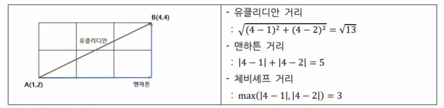
- 범주형 변수

  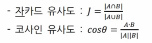

- 군집 간 거리 측정 방식
    - 최단 연결법(=단일 연결법) : 두 군집에서 가장 가까운 점 간의 거리
    - 최장 연결법(=완전 연결법) : 두 군집에서 가장 먼 점 간의 거리
    - 평균 연결법 : 두 군집의 모든 점 간의 거리의 평균
    - 중심 연결법 : 두 군집의 중심점 간의 거리
    - 와드 연결법 : 두 군집의 편차 제곱합이 최소가 되는 위치

### K-평균 군집화

- 비계층적 군집화 방법으로 거리기반
- 특징
    - 군집의 수 k를 사전에 지정
    - 중심점(centroid)을 기준으로 군집화
    - 이상치나 초기 중심점 설정에 민감
- 과정
    1. 군집의 개수 k개 설정 (Elbow Method 활용)
    2. 임의로 k개의 초기 중심점 설정
    3. 데이터들을 가장 가까운 군집에 할당
    4. 데이터의 평균으로 중심점 재설정
    5. 중심점 위치가 변하지 않을 때까지 3~4 반복
- k-means의 변형
    - k-modes : 범주형 데이터인 경우 최반값(mode) 활용
    - k-medoids : 실제 데이터의 대표 값을 중심점으로 선정하여 이상치에 강건

### DBSCAN

- 비계층적 군집화 방법으로 밀도기반
- 특징
    - 군집의 수 k를 사전에 지정하지 않음
    - 밀집된 영역을 군집으로 인식
    - 노이즈와 이상치에 강삽
    - Eps와 MinPts를 사전에 설정

### 기타 비계층적 군집분석

- SOM(자기조직화지도) :
    - 차원축소 + 인공신경망 + 군집화
    - 고차원 데이터를 저차원 격자 형태로 변환하여 시각화
- 퍼지군집화 - 각 데이터가 특정 군집에 속할 확률을 각각 계산해가며 군집화
- EM (기대최대화) : Likelihood의 기댓값을 계산하는 E단계와 기댓값 최대화 추정값을 계산하는 M단계를 반복하여 군집화

### 군집분석 평가지표

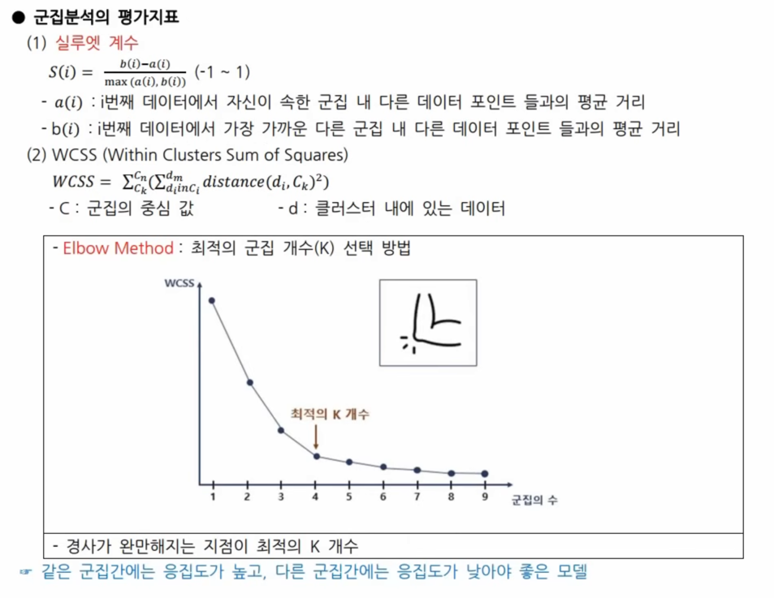

## 연관분석

- 항목들간의 조건-결과로 이루어지는 패턴을 발견하는 기법(장바구니 분석)
- 특징
    - 결과가 단순하고 분명(IF~THEN)
    - 비목적성 분석기법
    - 품목 수가 증가할수록 계산량이 기하급수적으로 증가
    - 연관 분석에 시간 개념을 추가하여 순차패턴분석을 수행

### 연관분석의 지표

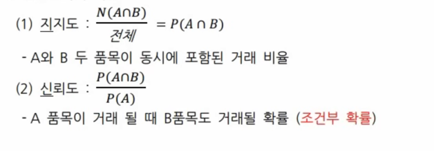
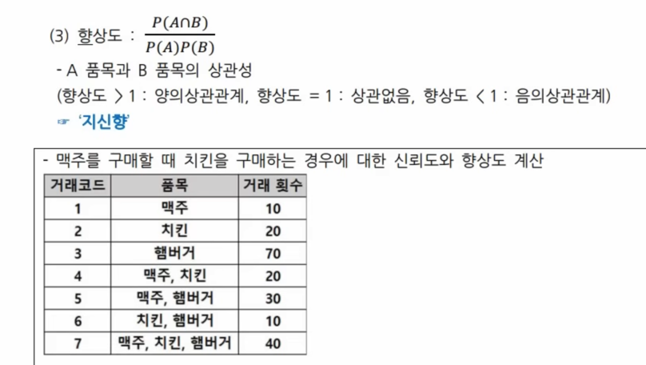
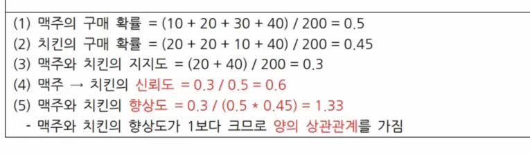

### 빈발항목 도출 알고리즘

- Apriori 알고리즘 : 빈발항목 집합의 모든 부분집합도 빈발항목 집합이라는 특성을 활용
    - 절차 : 빈도수 집합 탐색 -> 최소 지지도 확인 -> 후보 집합 생성 -> 반복 탐색 -> 연관규칙 도출
- FP-Growth 알고리즘 : 빈발항목 집합을 찾기 위해 트리 구조 활용

### 출처

- https://www.youtube.com/watch?v=zYTBA76aUCw&list=PLWtr7MRpQi5CW-jFYgAsX4jZcSp77O3a5&index=3!